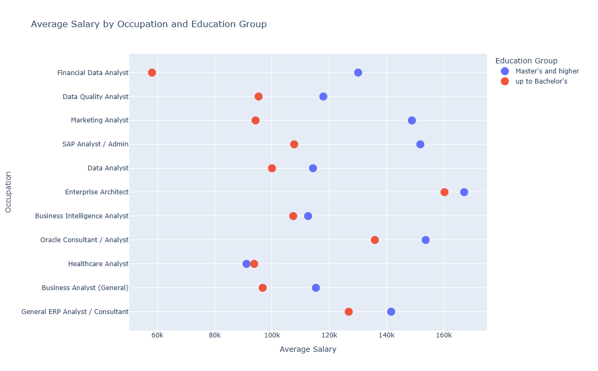
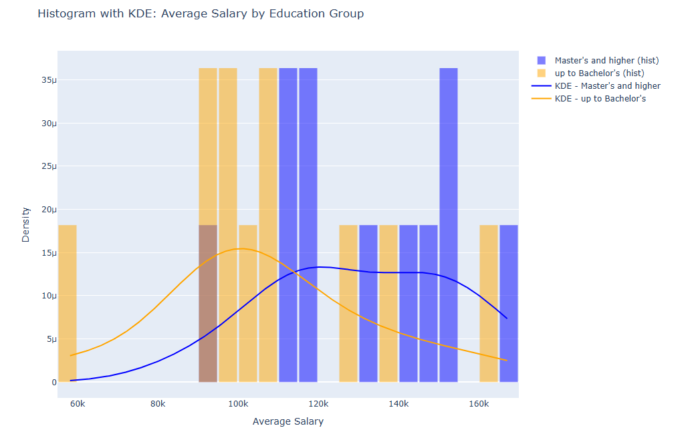
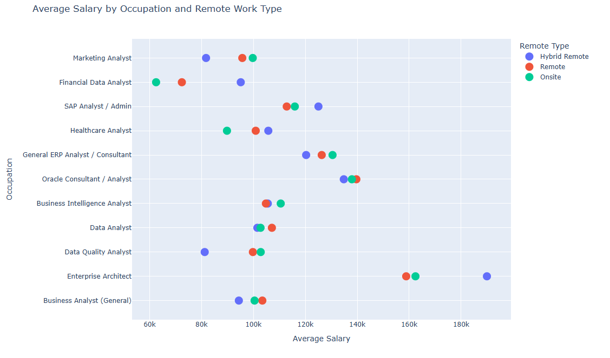
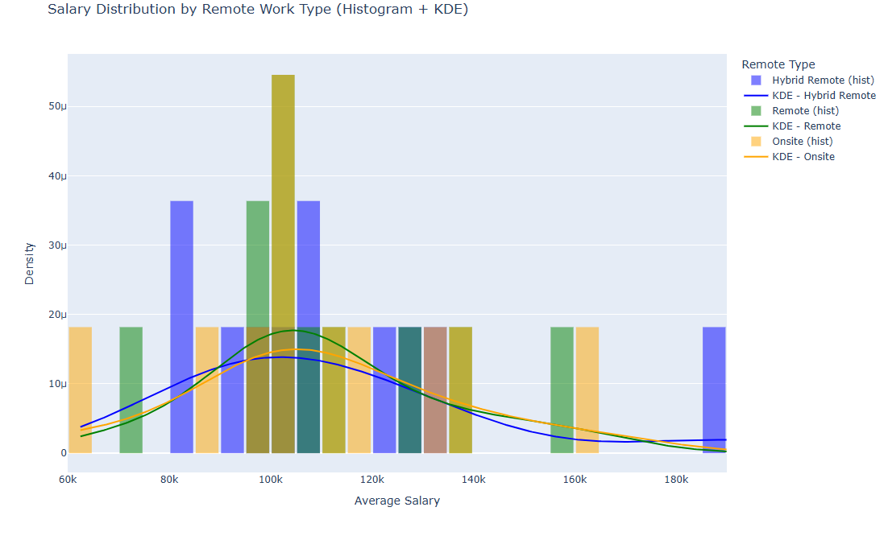

___

# STOPAS lab 07
___

For all the plots below the MAX_YEARS_EXPERIENCE column is not used, as directed, as it is comprised of roughly 88% NaN values in the Jobs_filtered dataset (filtered for inputs with salary information and also the columns containing date information are converted into a datetime format, as above). MIN_YEARS_EXPERIENCE a little better, however, still missing about 23% ...I little too high to impute. Additionally, I felt that it is easier to interpret the information and compare the categories when plotted together, as has been performed in plots 1-4

___

  
🔗 [download interactive version (HTML)](output/plot_01.html)

This plot shows the average salaries by LOT_V6_SPECIALIZED_OCCUPATION_NAME and education group (EDU_GROUP: two groups, ‘Master's and higher’ and ‘up to Bachelor's’). One can distinguish clearly that, in general, those with masters degrees tend to earn more than those without (with the exception of healthcare analysist). It is likely that experience will also play a significant role in effective salary, naturally. However, as we are primarily looking at entering this field without any major experience thus far (i.e. still students), and sections of the relevant columns are largely incomplete, it is not being accounted for in this search, as of current

---

  
🔗 [download interactive version (HTML)](output/plot_02.html)

Similar to plot_01, this plot shows the average salaries by LOT_V6_SPECIALIZED_OCCUPATION_NAME and education group (EDU_GROUP: two groups, Master's and higher’ and ‘up to Bachelor's’), this time as a histogram and also includes KDE curves for each group, a nice touch... This overlay style histogram with teh KDE curves is easier to interpret than the scatter above (opinion, of course) and one can visually determine a clear trend, after around 100K or so, that higher paying roles tend to be filled by people with higher education levels.

___

  
🔗 [download interactive version (HTML)](output/plot_03.html)

Note: the bulk of the roles tend to be Onsite (roughly 75%). With the scatterplot above there is no clear distinction between salaries on whether a job is remote or not, the dots are generally close together for most occupations. However, something of interest is that one can clearly see that Oracle Consultant/Analyst and Enterprise Architect are the highest paying in the group.

---

  
🔗 [download interactive version (HTML)](output/plot_04.html)

Using the same data setup from plot_03, plot _04 above indicated that the REMOTE_TYPE_NAME doesn’t have a major impact on realized salary, with the three groups landing generally close to one another. This does show, however, that many, but not all, of the highest paying roles fall into the Hybrid Remote category

___

__Alternatively, you can also access the analysis from here:__

You can also launch a live version of the notebook this way: 

